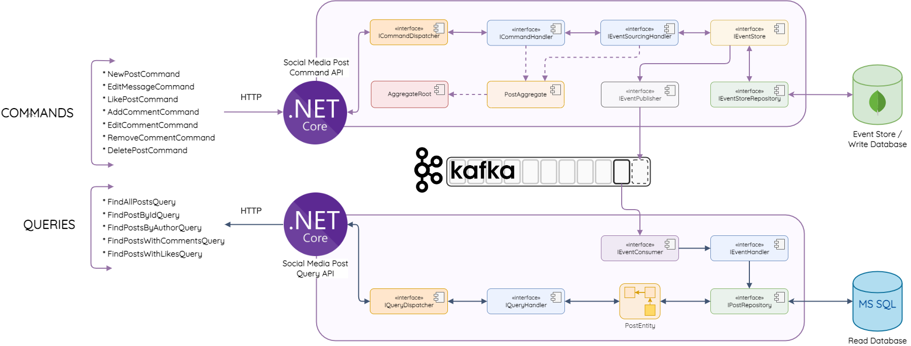

# CQRS .NET Core 6.0.407
Follow this course: https://www.udemy.com/course/net-microservices-cqrs-event-sourcing-with-kafka/

## Architecture


## Project structure
```
.
├── CQRS-ES
│   └── CQRS.Core
├── SM-Post
│   ├── Post.Cmd
│   │   ├── Post.Cmd.Api
│   │   ├── Post.Cmd.Domain
│   │   └── Post.Cmd.Infrastructure
│   └── Post.Query
│       ├── Post.Query.Api
│       ├── Post.Query.Domain
│       └── Post.Query.Infrastructure
└── docker-compose.yml
```

## Start project from scratch
### 1 Spin docker services
```bash
docker-compose up -d
```

### 2 Init project
```bash
mkdir CQRS-ES SM-Post
dotnet new classlib -o CQRS-ES/CQRS.Core
dotnet new sln -o SM-Post
## SM-Post/Post.Cmd
dotnet new webapi -o SM-Post/Post.Cmd/Post.Cmd.Api
dotnet new classlib -o SM-Post/Post.Cmd/Post.Cmd.Domain
dotnet new classlib -o SM-Post/Post.Cmd/Post.Cmd.Infrastructure
## SM-Post/Post.Query
dotnet new webapi -o SM-Post/Post.Query/Post.Query.Api
dotnet new classlib -o SM-Post/Post.Query/Post.Query.Domain
dotnet new classlib -o SM-Post/Post.Query/Post.Query.Infrastructure
```

### 3 Add projects to SM-Post.sln
```bash
cd SM-Post/
dotnet sln add ../CQRS-ES/CQRS.Core/CQRS.Core.csproj
dotnet sln add Post.Cmd/Post.Cmd.Api/Post.Cmd.Api.csproj
dotnet sln add Post.Cmd/Post.Cmd.Domain/Post.Cmd.Domain.csproj
dotnet sln add Post.Cmd/Post.Cmd.Infrastructure/Post.Cmd.Infrastructure.csproj
dotnet sln add Post.Query/Post.Query.Api/Post.Query.Api.csproj
dotnet sln add Post.Query/Post.Query.Domain/Post.Query.Domain.csproj
dotnet sln add Post.Query/Post.Query.Infrastructure/Post.Query.Infrastructure.csproj
```

### 4 Add references
```bash
cd ..
## SM-Post/Post.Cmd/Post.Cmd.Api
dotnet add SM-Post/Post.Cmd/Post.Cmd.Api/Post.Cmd.Api.csproj reference CQRS-ES/CQRS.Core/CQRS.Core.csproj
dotnet add SM-Post/Post.Cmd/Post.Cmd.Api/Post.Cmd.Api.csproj reference SM-Post/Post.Cmd/Post.Cmd.Domain/Post.Cmd.Domain.csproj
dotnet add SM-Post/Post.Cmd/Post.Cmd.Api/Post.Cmd.Api.csproj reference SM-Post/Post.Cmd/Post.Cmd.Infrastructure/Post.Cmd.Infrastructure.csproj
dotnet new classlib -o SM-Post/Post.Common
dotnet add SM-Post/Post.Cmd/Post.Cmd.Api/Post.Cmd.Api.csproj reference SM-Post/Post.Common/Post.Common.csproj
## SM-Post/Post.Cmd/Post.Cmd.Domain
dotnet add SM-Post/Post.Cmd/Post.Cmd.Domain/Post.Cmd.Domain.csproj reference CQRS-ES/CQRS.Core/CQRS.Core.csproj
dotnet add SM-Post/Post.Cmd/Post.Cmd.Domain/Post.Cmd.Domain.csproj reference SM-Post/Post.Common/Post.Common.csproj
## SM-Post/Post.Cmd/Post.Cmd.Infrastructure
dotnet add SM-Post/Post.Cmd/Post.Cmd.Infrastructure/Post.Cmd.Infrastructure.csproj reference CQRS-ES/CQRS.Core/CQRS.Core.csproj
dotnet add SM-Post/Post.Cmd/Post.Cmd.Infrastructure/Post.Cmd.Infrastructure.csproj reference SM-Post/Post.Cmd/Post.Cmd.Domain/Post.Cmd.Domain.csproj
## SM-Post/Post.Common
dotnet add SM-Post/Post.Common/Post.Common.csproj reference CQRS-ES/CQRS.Core/CQRS.Core.csproj
## SM-Post/Post.Query/Post.Query.Api
dotnet add SM-Post/Post.Query/Post.Query.Api/Post.Query.Api.csproj reference CQRS-ES/CQRS.Core/CQRS.Core.csproj
dotnet add SM-Post/Post.Query/Post.Query.Api/Post.Query.Api.csproj reference SM-Post/Post.Query/Post.Query.Domain/Post.Query.Domain.csproj
dotnet add SM-Post/Post.Query/Post.Query.Api/Post.Query.Api.csproj reference SM-Post/Post.Query/Post.Query.Infrastructure/Post.Query.Infrastructure.csproj
dotnet add SM-Post/Post.Query/Post.Query.Api/Post.Query.Api.csproj reference SM-Post/Post.Common/Post.Common.csproj
## SM-Post/Post.Query/Post.Query.Domain
dotnet add SM-Post/Post.Query/Post.Query.Domain/Post.Query.Domain.csproj reference CQRS-ES/CQRS.Core/CQRS.Core.csproj
dotnet add SM-Post/Post.Query/Post.Query.Domain/Post.Query.Domain.csproj reference SM-Post/Post.Common/Post.Common.csproj
## SM-Post/Post.Query/Post.Query.Infrastructure
dotnet add SM-Post/Post.Query/Post.Query.Infrastructure/Post.Query.Infrastructure.csproj reference CQRS-ES/CQRS.Core/CQRS.Core.csproj
dotnet add SM-Post/Post.Query/Post.Query.Infrastructure/Post.Query.Infrastructure.csproj reference SM-Post/Post.Query/Post.Query.Domain/Post.Query.Domain.csproj
```

### 5 NuGet: Add packages
CQRS.Core.csproj
- MongoDB.Driver 2.16.1

Post.Cmd.Infrastructure.csproj
- Confluent.Kafka 1.9.0
- Microsoft.Extensions.Options 6.0.0
- MongoDB.Driver 2.16.1

Post.Query.Infrastructure.csproj
- Confluent.Kafka 1.9.0
- Microsoft.EntityFrameworkCore.SqlServer 6.0.6
- Microsoft.Extensions.Hosting 6.0.1
```bash
cd SM-Post/
dotnet restore
```
