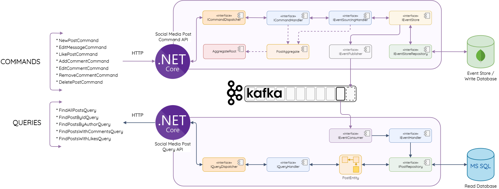

# Practice CQRS, Event Sourcing using .Net Core 6
Follow this course: https://www.udemy.com/course/net-microservices-cqrs-event-sourcing-with-kafka/

## Architecture Overview


## Mediator pattern
### 1. The command side

### 2. The query side


## Project structure
```
.
├── CQRS-ES
│   └── CQRS.Core
│       ├── Commands
│       │   └── BaseCommand.cs
│       ├── Consumers
│       │   └── IEventConsumer.cs
│       ├── Domain
│       │   ├── AggregateRoot.cs
│       │   └── IEventStoreRepository.cs
│       ├── Events
│       │   ├── BaseEvent.cs
│       │   └── EventModel.cs
│       ├── Exceptions
│       │   ├── AggregateNotFoundException.cs
│       │   └── ConcurrencyException.cs
│       ├── Handlers
│       │   └── IEventSourcingHandler.cs
│       ├── Infrastructure
│       │   ├── ICommandDispatcher.cs
│       │   ├── IEventStore.cs
│       │   └── IQueryDispatcher.cs
│       ├── Messages
│       │   └── Message.cs
│       ├── Producers
│       │   └── IEventProducer.cs
│       └── Queries
│           └── BaseQuery.cs
└── SM-Post
    ├── Post.Cmd
    │   ├── Post.Cmd.Api
    │   │   ├── Commands
    │   │   │   ├── AddCommentCmd.cs
    │   │   │   ├── CommandHandler.cs
    │   │   │   ├── DeletePostCmd.cs
    │   │   │   ├── EditCommentCmd.cs
    │   │   │   ├── EditMessageCmd.cs
    │   │   │   ├── ICommandHandler.cs
    │   │   │   ├── LikePostCmd.cs
    │   │   │   ├── NewPostCmd.cs
    │   │   │   ├── RemoveCommentCmd.cs
    │   │   │   └── RestoreReadDbCmd.cs
    │   │   ├── Controllers
    │   │   │   ├── AddCommentController.cs
    │   │   │   ├── DeletePostController.cs
    │   │   │   ├── EditCommentController.cs
    │   │   │   ├── EditMessageController.cs
    │   │   │   ├── LikePostController.cs
    │   │   │   ├── NewPostController.cs
    │   │   │   ├── RemoveCommentController.cs
    │   │   │   └── RestoreReadDbController.cs
    │   │   ├── DTOs
    │   │   │   └── NewPostResponse.cs
    │   │   ├── Program.cs
    │   │   ├── Properties
    │   │   │   └── launchSettings.json
    │   │   ├── appsettings.Development.json
    │   │   └── appsettings.json
    │   ├── Post.Cmd.Domain
    │   │   └── Aggregates
    │   │       └── PostAggregate.cs
    │   └── Post.Cmd.Infrastructure
    │       ├── Config
    │       │   └── MongoDbConfig.cs
    │       ├── Dispatchers
    │       │   └── CommandDispatcher.cs
    │       ├── Handlers
    │       │   └── EventSourcingHandler.cs
    │       ├── Producers
    │       │   └── EventProducer.cs
    │       ├── Repositories
    │       │   └── EventStoreRepository.cs
    │       └── Stores
    │           └── EventStore.cs
    ├── Post.Common
    │   ├── DTOs
    │   │   └── BaseResponse.cs
    │   └── Events
    │       ├── CommentAddedEvent.cs
    │       ├── CommentRemovedEvent.cs
    │       ├── CommentUpdatedEvent.cs
    │       ├── MessageUpdatedEvent.cs
    │       ├── PostCreatedEvent.cs
    │       ├── PostLikedEvent.cs
    │       └── PostRemovedEvent.cs
    └── Post.Query
        ├── Post.Query.Api
        │   ├── Controllers
        │   │   └── PostLookupController.cs
        │   ├── DTOs
        │   │   └── PostLookupResponse.cs
        │   ├── Program.cs
        │   ├── Properties
        │   │   └── launchSettings.json
        │   ├── Queries
        │   │   ├── FindAllPostsQuery.cs
        │   │   ├── FindPostByIdQuery.cs
        │   │   ├── FindPostsByAuthorQuery.cs
        │   │   ├── FindPostsWithCommentsQuery.cs
        │   │   ├── FindPostsWithLikesQuery.cs
        │   │   ├── IQueryHandler.cs
        │   │   └── QueryHandler.cs
        │   ├── appsettings.Development.json
        │   └── appsettings.json
        ├── Post.Query.Domain
        │   ├── Entities
        │   │   ├── CommentEntity.cs
        │   │   └── PostEntity.cs
        │   └── Repositories
        │       ├── ICommentRepository.cs
        │       └── IPostRepository.cs
        └── Post.Query.Infrastructure
            ├── Consumers
            │   ├── ConsumerHostedService.cs
            │   └── EventConsumer.cs
            ├── Converters
            │   └── EventJsonConverter.cs
            ├── DataAccess
            │   ├── DatabaseContext.cs
            │   └── DatabaseContextFactory.cs
            ├── Dispatchers
            │   └── QueryDispatcher.cs
            ├── Handlers
            │   ├── EventHandler.cs
            │   └── IEventHandler.cs
            └── Repositories
                ├── CommentRepository.cs
                └── PostRepository.cs
```

## Steps to run project using Visual Studio Code
### 1. Clone
```bash
git clone https://github.com/vkhanhqui/cqrs_net_course.git
code cqrs_net_course
```
### 2. Build
```bash
docker-compose up -d
cd SM-Post/
dotnet restore
dotnet build
```
### 3. Run
- Choose <b>Run and Debug</b> tab
- Run:
    - Post.Cmd.Api // Command side
    - Post.Query.Api // Query side
### 4. Test
Base URL: http://localhost:5010/api/v1/[controller]

URL + Query/Path/Body + Method: Look at <b>Controllers</b> folders

### 5. MSSQL Account
```
username: sa
password: Password123
database: SocialMedia
```
